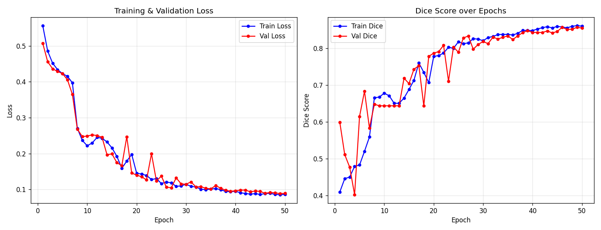
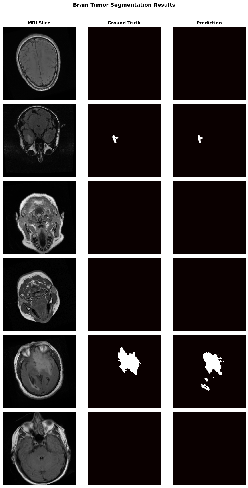

# Brain Tumor Segmentation with U-Net

A U-Net model for pixel-level segmentation of brain tumors in MRI slices. Trained and evaluated on the Kaggle LGG MRI Segmentation dataset, with Grad-CAM visualization for inference-time interpretability.

## Results

Trained for 50 epochs on the LGG dataset.

| Metric | Score |
|---|---:|
| Dice | 0.852 |
| IoU | 0.822 |
| Sensitivity | 0.872 |
| Specificity | 0.998 |
| Pixel Accuracy | 0.995 |

Training and validation curves stayed close throughout training, with no obvious divergence.



Predicted masks compared against ground truth on held-out slices. Tumor-free slices are included to check for false positives.



## Project Structure

````
brain_tumor_segmentation/
├── model.py        # U-Net architecture + losses (Dice, Combined)
├── dataset.py      # Dataset classes (Synthetic, Kaggle LGG, BraTS-ready)
├── metrics.py      # Dice, IoU, Sensitivity, Specificity, Hausdorff
├── train.py        # Full training loop with checkpointing & plots
├── inference.py    # Single-image inference + Grad-CAM visualisation
├── requirements.txt
└── README.md
````
---
## Quick Start
### 1. Install dependencies
```bash
pip install -r requirements.txt
```
### 2. Train (synthetic data — no download needed)
```bash
python train.py --dataset synthetic --epochs 30 --batch_size 8
```
### 3. Train (Kaggle LGG dataset)
Download from: https://www.kaggle.com/datasets/mateuszbuda/lgg-mri-segmentation
```bash
python train.py --dataset kaggle \
                --data_root ./data/lgg-mri-segmentation \
                --epochs 50 --batch_size 8 --lr 1e-4
```
### 4. Run inference + Grad-CAM
```bash
python inference.py --checkpoint outputs/best_model.pth \
                    --image path/to/mri.png \
                    --output result.png
```
Trained weights are not included in this repository.

---
## Dataset Options
| Dataset | Size | Access | Modality |
|---------|------|--------|----------|
| Synthetic | Infinite | Built-in | Simulated MRI |
| Kaggle LGG MRI | 3,929 images | Free (Kaggle login) | T1-weighted |
| BraTS 2021 | ~1,251 patients | Free (registration) | T1, T2, FLAIR, T1ce |
---
## Architecture

````
Input (1×256×256)
    │
    ├── Encoder: 4× [DoubleConv → MaxPool]   (64→128→256→512)
    │
    ├── Bottleneck: DoubleConv (1024)
    │
    └── Decoder: 4× [Upsample → Skip Concat → DoubleConv]
            │
        Output (2×256×256) → argmax → Binary Mask
````

**Key design choices:**

- Skip connections preserve spatial detail lost during downsampling
- Batch Normalisation for stable training
- Combined Dice + Cross-Entropy loss handles class imbalance
- Cosine Annealing LR scheduler
````
````

Use GitHub's **Preview** tab before committing — you'll see instantly if it's right.

Also check the Quick Start `bash` blocks — same problem may have hit them. Scroll and look.
## Evaluation Metrics
| Metric | Description |
|--------|-------------|
| **Dice Score** | Overlap agreement (main metric in medical seg.) |
| **IoU** | Intersection over Union (Jaccard) |
| **Pixel Accuracy** | % correctly classified pixels |
| **Sensitivity** | True Positive Rate — how much tumor is captured |
| **Specificity** | True Negative Rate — healthy tissue preservation |
| **Hausdorff (95th %)** | Worst-case boundary error in pixels |
---
## References
1. Ronneberger et al., "U-Net: Convolutional Networks for Biomedical Image
   Segmentation", MICCAI 2015. https://arxiv.org/abs/1505.04597
2. Menze et al., "The Multimodal Brain Tumor Image Segmentation Benchmark
   (BraTS)", IEEE Trans. Med. Imaging, 2015.
3. Buda et al., "Association of genomic subtypes of lower-grade gliomas with
   shape features automatically extracted by a deep learning algorithm",
   Computers in Biology and Medicine, 2019.
4. Milletari et al., "V-Net: Fully Convolutional Neural Networks for Volumetric
   Medical Image Segmentation", 3DV 2016 (Dice Loss).
